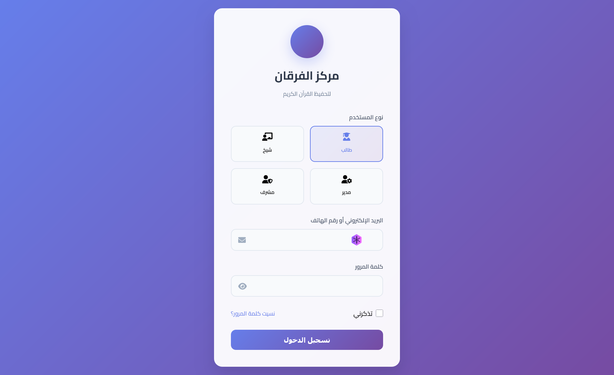
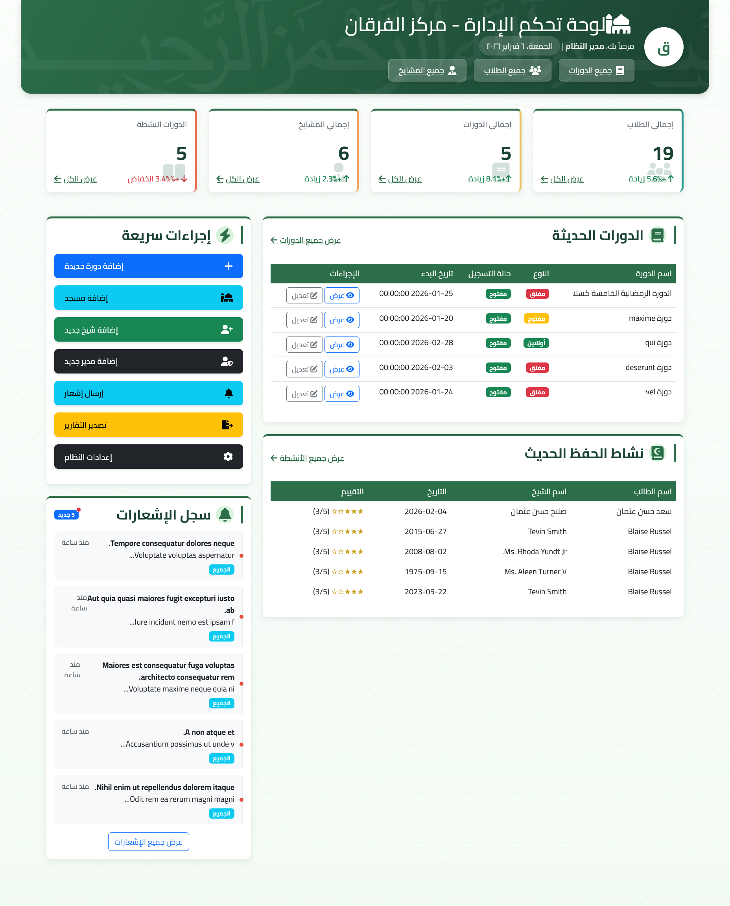
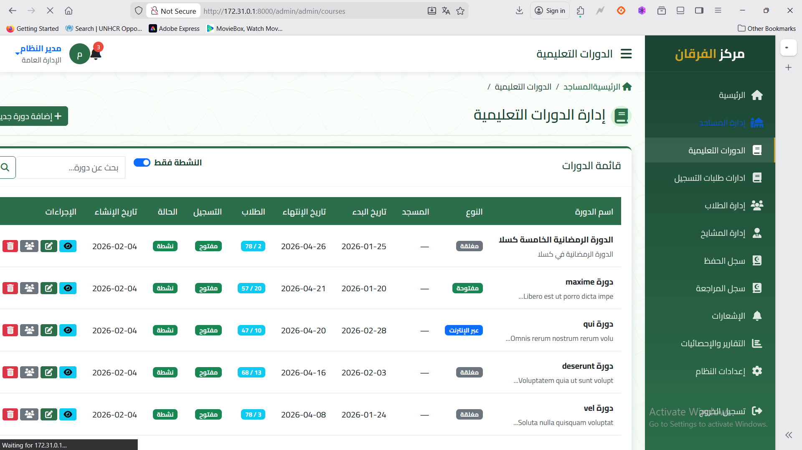

# Markaz Al-Furqan Laravel Backend

## Overview

This is the Laravel backend API for the Markaz Al-Furqan Quran memorization application. It provides a comprehensive RESTful API for managing users, courses, enrollments, hifz logs, and notifications.

## Features

### Authentication & Authorization

-   JWT-based authentication using Laravel Sanctum
-   Role-based access control (Student, Sheikh, Admin, Supervisor)
-   Secure password hashing and token management
-   Profile management and password change functionality

### User Management

-   Multi-role user system
-   Profile image upload and management
-   User activation/deactivation
-   Comprehensive user search and filtering

### Course Management

-   Course creation and management
-   Multiple course types (Online, Open, Closed)
-   Enrollment system with approval workflow
-   Course capacity management
-   Image upload for courses

### Hifz & Review Tracking

-   Detailed hifz (memorization) logging
-   Review session tracking
-   Evaluation system with multiple grades
-   Progress tracking and statistics
-   Surah and Ayah-level tracking

### Notification System

-   Real-time notifications
-   Role-based notification targeting
-   Read/unread status tracking
-   Notification history

### Group Management

-   Course-based group creation
-   Student assignment to groups
-   Sheikh assignment to groups
-   Group capacity management

### Mosque Management

-   Mosque registration and management
-   Location tracking with coordinates
-   Course association with mosques

## API Endpoints

### Authentication

```
POST /api/v1/register          - Register new user
POST /api/v1/login             - User login
POST /api/v1/logout            - User logout
GET  /api/v1/user              - Get authenticated user
PUT  /api/v1/profile           - Update user profile
PUT  /api/v1/change-password   - Change password
POST /api/v1/refresh-token     - Refresh authentication token
```

### Courses

```
GET  /api/v1/courses                    - Get all courses (with filters)
GET  /api/v1/courses/featured           - Get featured courses
GET  /api/v1/courses/{id}               - Get course details
GET  /api/v1/courses/{id}/stats         - Get course statistics
POST /api/v1/courses/{id}/enroll        - Enroll in course
DELETE /api/v1/courses/{id}/withdraw    - Withdraw from course
GET  /api/v1/my-courses                 - Get user's enrolled courses
GET  /api/v1/my-progress/{course}       - Get progress in course
GET  /api/v1/my-evaluations/{course}    - Get evaluations for course
```

### Hifz Management (Sheikh)

```
POST /api/v1/sheikh/hifz-logs           - Create hifz log
PUT  /api/v1/sheikh/hifz-logs/{id}      - Update hifz log
DELETE /api/v1/sheikh/hifz-logs/{id}    - Delete hifz log
GET  /api/v1/sheikh/hifz-logs           - Get hifz logs
POST /api/v1/sheikh/review-logs         - Create review log
PUT  /api/v1/sheikh/review-logs/{id}    - Update review log
DELETE /api/v1/sheikh/review-logs/{id}  - Delete review log
GET  /api/v1/sheikh/review-logs         - Get review logs
```

### Sheikh Management

```
GET  /api/v1/sheikh/courses             - Get sheikh's courses
GET  /api/v1/sheikh/students            - Get sheikh's students
GET  /api/v1/sheikh/statistics          - Get sheikh statistics
GET  /api/v1/sheikh/reports/students    - Students report
GET  /api/v1/sheikh/reports/progress    - Progress report
```

### Admin Management

```
GET  /api/v1/admin/users                - Get all users
POST /api/v1/admin/users                - Create user
PUT  /api/v1/admin/users/{id}           - Update user
DELETE /api/v1/admin/users/{id}         - Delete user
POST /api/v1/admin/courses              - Create course
PUT  /api/v1/admin/courses/{id}         - Update course
DELETE /api/v1/admin/courses/{id}       - Delete course
GET  /api/v1/admin/enrollments          - Get all enrollments
POST /api/v1/admin/enrollments/{id}/approve - Approve enrollment
POST /api/v1/admin/enrollments/{id}/reject  - Reject enrollment
```

### Notifications

```
GET  /api/v1/notifications              - Get user notifications
POST /api/v1/notifications/{id}/read    - Mark notification as read
POST /api/v1/notifications/mark-all-read - Mark all as read
DELETE /api/v1/notifications/{id}       - Delete notification
```

## Database Schema

### Core Tables

-   **users** - User accounts with roles
-   **mosques** - Mosque information
-   **courses** - Course details and settings
-   **course_enrollments** - Student enrollments in courses
-   **groups** - Course groups for organization
-   **hifz_logs** - Memorization session records
-   **review_logs** - Review session records
-   **notifications** - System notifications
-   **user_notifications** - User-notification relationships

### Pivot Tables

-   **course_sheikhs** - Sheikh assignments to courses
-   **group_students** - Student assignments to groups
-   **model_has_roles** - User role assignments (Spatie)
-   **model_has_permissions** - User permission assignments (Spatie)

## Installation & Setup

### Requirements

-   PHP 8.1+
-   MySQL 8.0+ or PostgreSQL 13+
-   Composer
-   Laravel 10.x

### Installation Steps

1. **Clone and Install Dependencies**

```bash
git clone <repository-url>
cd markaz-al-furqan-backend
composer install
```

2. **Environment Configuration**

```bash
cp .env.example .env
php artisan key:generate
```

3. **Database Configuration**
   Update `.env` file with your database credentials:

```env
DB_CONNECTION=mysql
DB_HOST=127.0.0.1
DB_PORT=3306
DB_DATABASE=markaz_al_furqan
DB_USERNAME=your_username
DB_PASSWORD=your_password
```

4. **Run Migrations and Seeders**

```bash
php artisan migrate
php artisan db:seed
```

5. **Storage Setup**

```bash
php artisan storage:link
```

6. **Start Development Server**

```bash
php artisan serve
```

## Configuration

### CORS Configuration

The API is configured to accept requests from any origin for development. Update `config/cors.php` for production:

```php
'allowed_origins' => ['https://your-frontend-domain.com'],
```

### File Upload Configuration

Configure file upload limits in `.env`:

```env
MAX_FILE_SIZE=10240
ALLOWED_IMAGE_TYPES=jpg,jpeg,png,gif,webp
ALLOWED_DOCUMENT_TYPES=pdf,doc,docx
```

### Sanctum Configuration

Configure Sanctum for your domains in `.env`:

```env
SANCTUM_STATEFUL_DOMAINS=localhost,127.0.0.1,your-domain.com
```

## Security Features

### Authentication

-   Laravel Sanctum for API token authentication
-   Secure password hashing with bcrypt
-   Token expiration and refresh mechanism
-   Rate limiting on authentication endpoints

### Authorization

-   Role-based access control using Spatie Laravel Permission
-   Route-level middleware protection
-   Resource-level authorization policies
-   API endpoint access restrictions

### Data Validation

-   Comprehensive request validation
-   SQL injection prevention
-   XSS protection
-   File upload security

### API Security

-   CORS configuration
-   Request rate limiting
-   Input sanitization
-   Error handling without information disclosure

## Performance Optimization

### Database

-   Proper indexing on frequently queried columns
-   Eager loading to prevent N+1 queries
-   Database query optimization
-   Pagination for large datasets

### Caching

-   Model caching for static data
-   Query result caching
-   API response caching
-   File caching for uploaded images

### API Optimization

-   Response compression
-   Efficient JSON serialization
-   Minimal data transfer
-   Optimized database queries

## Screenshots

### Login



### Dashboard



### Progress Tracking



## Deployment

### Production Checklist

1. Set `APP_ENV=production` in `.env`
2. Set `APP_DEBUG=false` in `.env`
3. Configure proper database credentials
4. Set up SSL certificates
5. Configure file storage (AWS S3 recommended)
6. Set up proper CORS origins
7. Configure mail settings
8. Set up monitoring and logging

### Deployment Commands

```bash
# Optimize for production
php artisan config:cache
php artisan route:cache
php artisan view:cache
php artisan optimize

# Run migrations
php artisan migrate --force

# Clear caches if needed
php artisan cache:clear
php artisan config:clear
```

## Monitoring & Logging

### Logging

-   Application logs in `storage/logs/`
-   Database query logging (development)
-   API request/response logging
-   Error tracking and reporting

### Health Checks

-   Database connectivity check
-   File system access check
-   External service availability
-   Performance metrics

## API Documentation

### Response Format

All API responses follow this standard format:

```json
{
  "success": true|false,
  "message": "Human readable message",
  "data": {}, // Response data
  "meta": {}, // Pagination and metadata
  "errors": {} // Validation errors (if any)
}
```

### Error Handling

-   Consistent error response format
-   Proper HTTP status codes
-   Localized error messages in Arabic
-   Detailed validation error messages

### Pagination

-   Cursor-based pagination for large datasets
-   Configurable page sizes
-   Metadata for pagination controls

## Support & Maintenance

### Regular Maintenance

-   Database backup and cleanup
-   Log file rotation
-   Security updates
-   Performance monitoring

### Troubleshooting

-   Check application logs
-   Verify database connectivity
-   Confirm file permissions
-   Review configuration settings

For technical support or questions, please contact sideegmohammednoor@gmail.com
